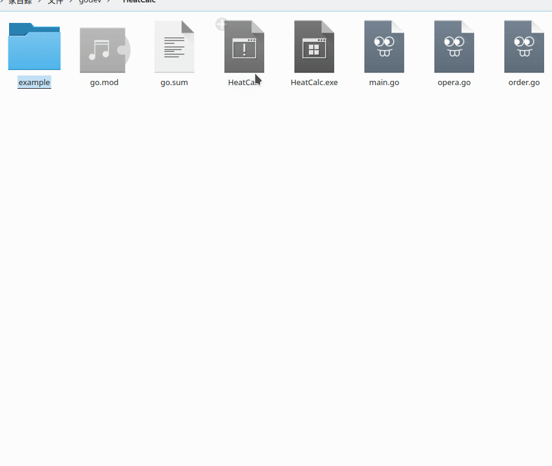
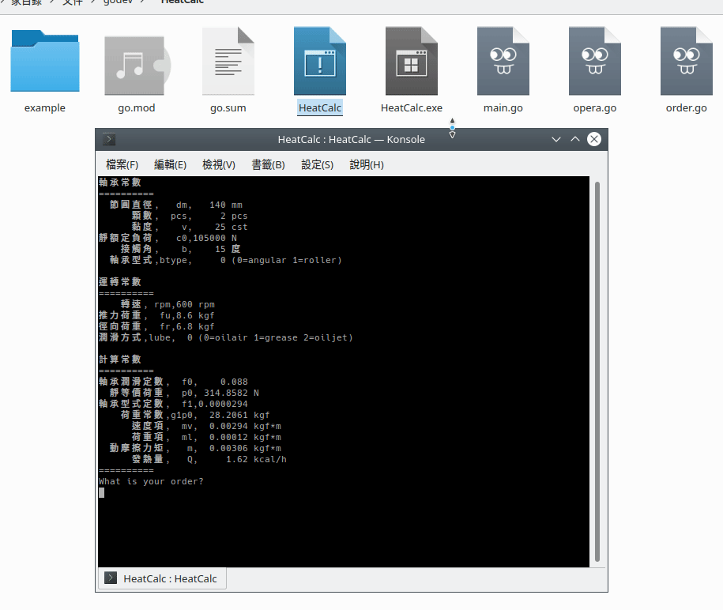
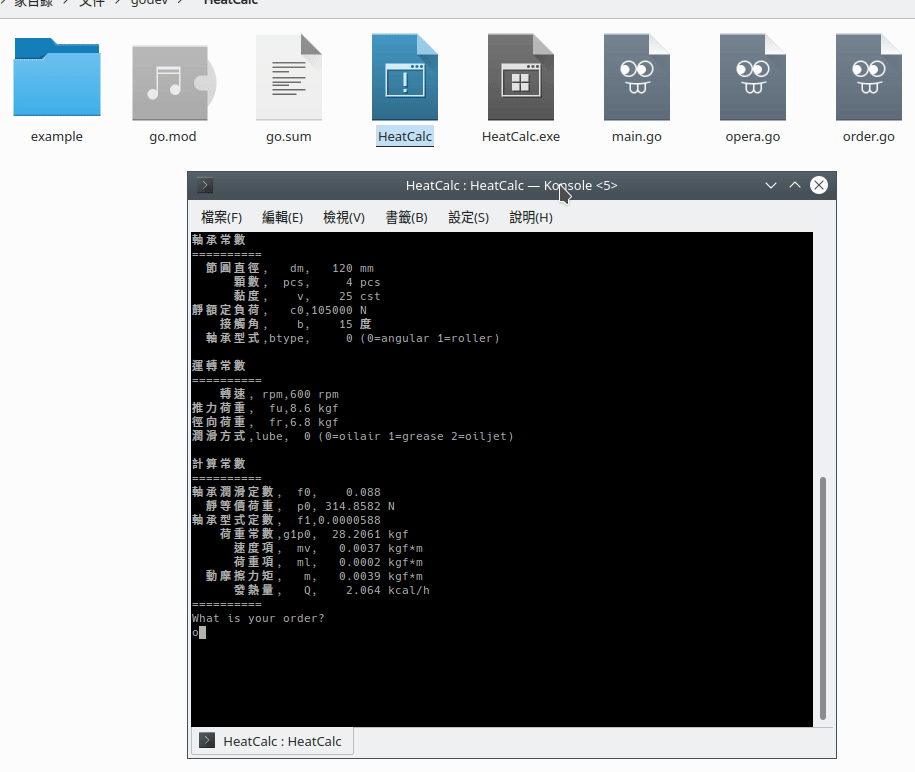

# HeatCalc

## How To Use

### Input the parameter

> You can input the parameter by "="

> Also , you could input the multiple parameter by split with ","

### Save the parameter or Load the parameter

> The default file extension is ".ht"  

- Use the "save=" to save the parameter right now  
- Use the "load=" to load the file

----

## Unlease

- 錯誤回報功能
- help功能
- 顯示單位功能

----

## Version

### [1.1.0] 2020.02.23

#### add

- 現在看得到參數的單位
- 增加了儲存與讀取的功能
- README增加使用方法

#### change

- 改用物件的寫法來整理參數

### [1.0.1] 2019.10.10

#### add

- 使用mod來管理package

### [1.0.0] 2019.10.10

> 基本功能完成
